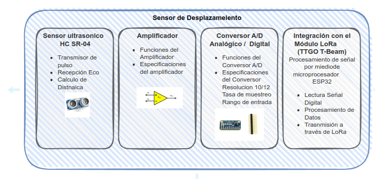
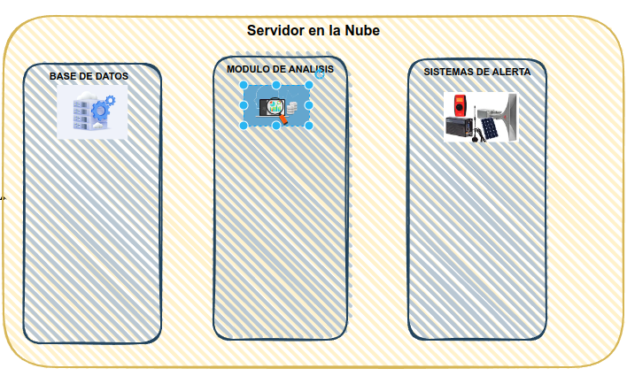

# Desarrollo de un Sistema de Alerta Temprana para el Monitoreo del Desplazamiento de Terreno en el Volcán Irazú Basado en Tecnología LoRa
# Integrantes
- Gerardo Araya Fallas
- Carlos Elizondo Alfaro
- Walter Serrano Concepción
- Fabián Chacón Solano

# Introducción

## Objetivo principal

- Desarrollo de un Sistema de Alerta Temprana para el
Monitoreo del Desplazamiento de Terreno en el Volcán
Irazú Basado en Tecnología LoRa

### Descripción del problema

- El proyecto tiene como meta realizar un sistema de monitoreo en el volcán Irazú, esto con el fin de analizar el movimiento de tierras que existe en la zona, específicamente en la ubicación de las antenas, lugar donde previamente se han producido deslizamientos de relevancia y afectaron las comunicaciones en su momento por las antenas que cayeron.

- De esta manera se agrega un sistema de monitoreo que mide la distancia en metros desde el origen hasta la grieta por analizar, cuando se detecta un desplazamiento relevante fuera de los últimos datos obtenidos se lanza una alarma.

### Fotografías del área

#### Grietas presentes en el área

#### Desplazamientos de tierra ocurridos en el pasado 

# Horas de distribución para la ejecución del proyecto

| **Fase del Proyecto**      | **Tarea**                                  | **Horas Estimadas (Redondeadas)** |
|----------------------------|--------------------------------------------|-----------------------------------|
| **Planificación**          | Definir requisitos y especificaciones del sistema | 13                                |
|                            | Identificar los componentes necesarios     | 5                                 |
|                            | Establecer cronograma y asignar recursos   | 8                                 |
| **Diseño**                 | Esquema de hardware (circuito electrónico) | 20                                |
|                            | Diseño de firmware (software para dispositivos) | 27                            |
|                            | Diseño de software de aplicación           | 33                                |
|                            | Diseño de interfaz gráfica                 | 13                                |
| **Desarrollo**             | Prototipado de dispositivos                | 27                                |
|                            | Programación del firmware                  | 40                                |
|                            | Desarrollo de la aplicación                | 50                                |
|                            | Pruebas de integración                     | 20                                |
| **Pruebas y Validación**   | Pruebas de alcance                         | 13                                |
|                            | Pruebas de consumo de energía              | 10                                |
|                            | Pruebas de seguridad                       | 10                                |
|                            | Pruebas de usabilidad                      | 8                                 |
| **Documentación**          | Documentación técnica                      | 13                                |
|                            | Guías de usuario                           | 11                                |
| **Implementación**         | Despliegue del sistema                     | 13                                |
|                            | Capacitación de usuarios                   | 7                                 |
| **Soporte y Mantenimiento**| Soporte técnico                            | 13                                |
|                            | Actualizaciones de firmware y software     | 20                                |
|                            | Mantenimiento del sistema                  | 13                                |
| **Total de Horas Estimadas**|                                           | **405**                           |

# Diagramas de nivel

- **Sensor de desplazamiento:** Mide el desplazamiento de la masa de tierra.
- **Módulo Lora:** Transmite los datos del sensor a una estación base.
- **Estación base:** Recibe datos del módulo LoRa y los envía a un servidor a través de internet.
- **Servidor en la nube:** Recibe y almacena datos, realiza análisis y genera alertas.
- **Interfaz de usuario:** Permite la visualización de datos y alertas en tiempo real.  

 

## Diagramas de tercer Nivel

## Diagrama de cuarto nivel

# LoRa APRS Tracker/Station
Este Firmware es para ser usado en Tarjetas ESP32 con módulos LoRa y GPS para funcionar en APRS.

## Pruebas iniciales del módulo de rastreo LoRa APRS

El módulo de rastreo a utilizar en este proyecto es el __T-Beam-AXP2101-V1.2__

Modelo de Prueba

Pruebas Iniciales del Tracker

Prueba de Rastreo en Mapa <a href="https://aprs.fi/#!lat=9.9354&lng=-84.1032" target="_blank">APRS</a>

# Implementación del sistema

# Gráficas y reportes

### Packets transmitidos por hora

### Packets enviados mediante RF al sitio APRS

### Packets escuchados/recibidos por el tracker

## Aparición en sitio APRS

## Demostración de interfaz gráfica para obtención de datos

# Interfaz programada y línea de comandos

